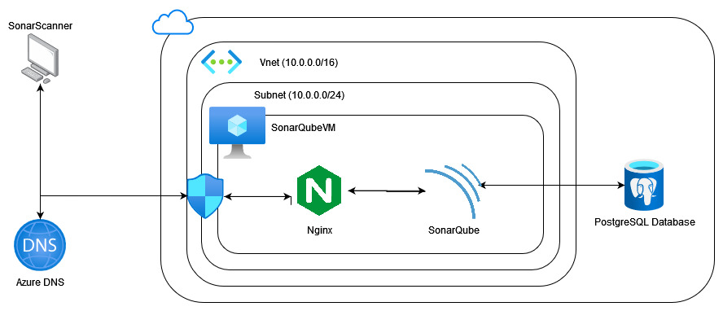

# Terraform Sonarqube

This project intends to provision all underline infrastructure for [Sonarqube](https://www.sonarqube.org/) application. The infrastructure aims to be reliable and stable, perfect to run in a production ready environment.



## Before Beginning
---

There are two variations of this project:

- `Sonarqube with SSL Proxy`

  If you desire to run Sonarqube with SSL Proxy it is necessary to edit the [ssl.tfvars file](./src/ssl.tfvars), filling up two variables `dns` and `ssl_certificates`. 
  
  The variable `dns` is the information about [Azure DNS](https://docs.microsoft.com/en-us/azure/dns/dns-overview) like its name, resource group and the cname record that will be create for sonarqube. Thus, in order to provision sonarqube with SSL it is a prerequisite to have an Azure DNS already configured in your Azure environment.

  And the variable `ssl_certificates` is the local path for the ssl public and private certificate file, that will be used by [Nginx](https://nginx.org/en/) in order to handle SSL traffic.

- `Sonarqube without SSL Proxy (Simple Proxy)`

  This is the easy way to provision Sonarqube, and it is not required to perform any modification in the source code.

## Setup
---
- [Create an Azure Account](https://azure.microsoft.com/en-us/free/)
- [Install TF_ENV](https://github.com/tfutils/tfenv)
- [Create an Azure DNS zone](https://docs.microsoft.com/en-us/azure/dns/dns-getstarted-portal) (Optional for SSL Proxy)

```bash
cd src
az login
tfenv install
tfenv use
terraform init

# Now execute the terraform apply accordingly with your choice
# terraform apply - provision infrastructure without SSL Proxy
# terraform apply --var-file=ssl.tfvars - provision infrastructure using SSL Proxy

terraform apply
```

## Results
---


## Analyzing your Code
---

In order to analyze your source code it is necessary to perform the following steps:

1. Configure your Project - create a file in your root directory called `sonar-project.propertie`s like [this](https://github.com/tmissao/python-template/blob/master/sonar-project.properties). Here is the [link](https://docs.sonarqube.org/latest/analysis/scan/sonarscanner/) of the sonar analyzing documentation. This file will be used by SonarScanner during the analyze process.

2. Create a SonarQube authentication token - This token will allow SonarScanner to connect into your Sonarqube and send information about the analyze performed. Here is a [link](https://docs.sonarqube.org/latest/user-guide/user-token/) of the documentation about how create this token.

3. Execute the SonarScanner - I believe that the best way to run SonarScanner is using [Docker](https://www.docker.com/). This [documentation](https://docs.sonarqube.org/latest/analysis/scan/sonarscanner/) shows how to perform it.

The code bellow exemplifies how I performed the analyze.

```bash
git clone git@github.com:tmissao/python-template.git
cd python-template

docker run --rm \
  -e SONAR_HOST_URL="https://sonarqube.cloudfeeling.com.br" \
  -e SONAR_LOGIN="myAuthenticationToken" \
  -v "$(pwd):/usr/src" \
  sonarsource/sonar-scanner-cli
``` 


## References
---

- [`CloudInit Example`](https://github.com/ukayani/cloud-init-example)
- [`CloudInit Ubuntu Documentation`](https://help.ubuntu.com/community/CloudInit)
- [`CloudInit Documentation`](https://cloudinit.readthedocs.io/en/latest/topics/format.html)
- [`SonarQube Install`](https://docs.sonarqube.org/latest/setup/install-server/)
- [`SonarQube Requirements`](https://docs.sonarqube.org/latest/requirements/requirements/)
